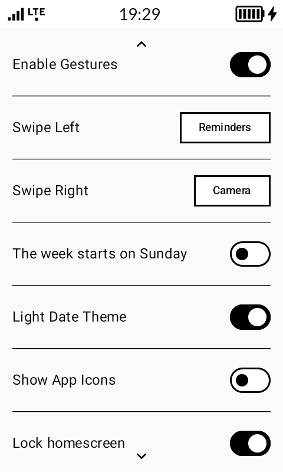
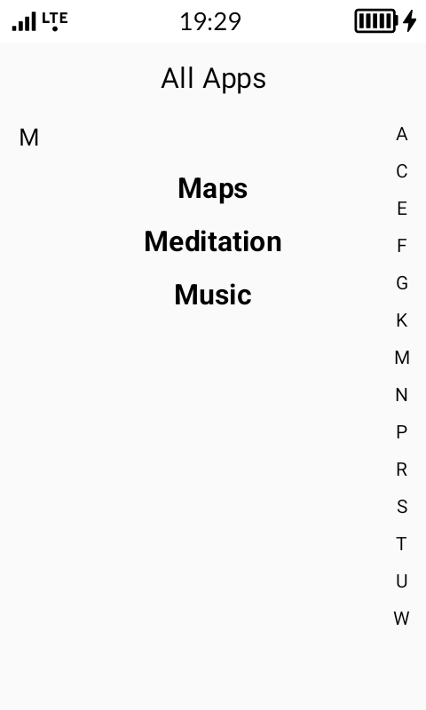
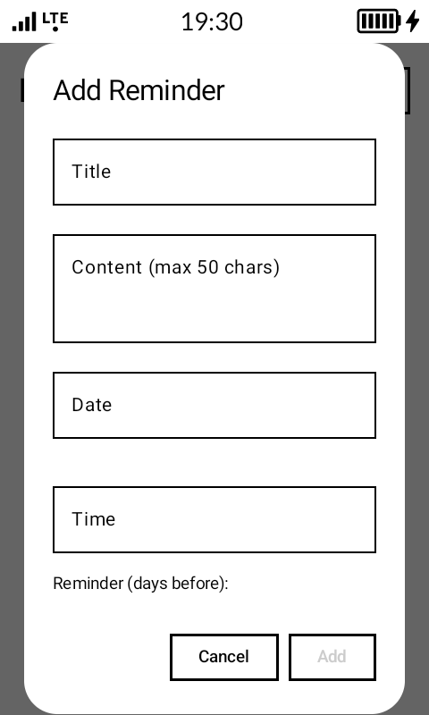
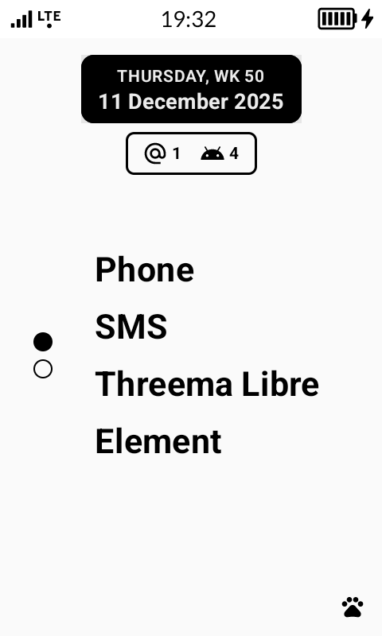

# Sexy Launcher

A minimalist, e-ink friendly launcher for Android, designed specifically for the **Mudita Kompakt** phone to provide a clean, fast, and focused user experience.

## Features

- **Minimalist Home Screen**: Displays only your favorite apps, the current date, next alarm, battery level, and birthday reminders.
- **Customizable Favorites**: Choose the number of favorite app slots on your home screen.
- **Integrated Notifications**: A dedicated screen for all your notifications, with categorized icons (messages, calls, email) on the home screen for a quick overview.
- **App Drawer**: A simple A-Z list of all your applications with a fast-scroll alphabet index.
- **App Customization**: Long-press an app in the drawer to rename or uninstall it.
- **Gesture Control**:
    - Swipe up to open the app drawer.
    - Customizable left and right swipe actions (e.g., open birthdays, or a specific app).
- **E-Ink Friendly Theming**:
    - Toggle app icons on/off for a purely text-based experience ("Show App Icons").
    - Choose between a light and dark theme for the date widget ("Inverted Date Theme").

## Screenshots

<table>
  <tr>
    <td align="center"> <b>Homescreen</b></td>
    <td align="center"> <b>All Apps</b></td>
    <td align="center"> <b>Control Panel</b></td>
    <td align="center"> <b>Notifications</b></td>
  </tr>
  <tr>
    <td align="center"> <b>Customize App</b></td>
    <td align="center"> <b>Filter by Letter</b></td>
    <td align="center"> <b>Add Reminders</b></td>
    <td align="center"> <b>Inverted Date Theme</b></td>
  </tr>
  <tr>
    <td align="center" colspan="4"> <b>Show/Hide App Icons</b></td>
  </tr>
</table>
