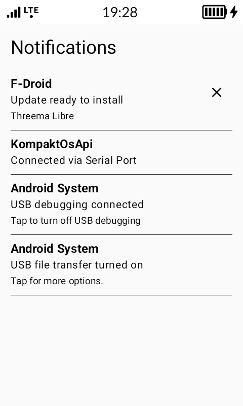
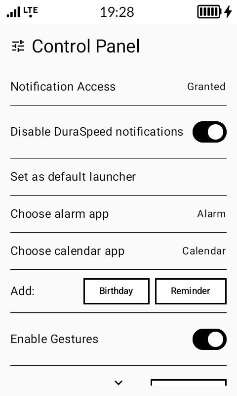
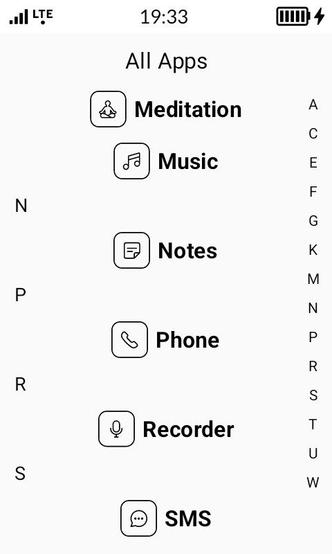

# Sexy Launcher

A minimalist, e-ink friendly launcher for Android, designed specifically for the **Mudita Kompakt** phone to provide a clean, fast, and focused user experience.

## Features

- **Minimalist Home Screen**: Displays only your favorite apps, the current date and time, next alarm, battery level, and birthday reminders.
- **Customizable Favorites**: Choose the number of favorite app slots on your home screen.
- **Integrated Notifications**: A dedicated screen for all your notifications, with categorized icons (messages, calls, email) on the home screen for a quick overview.
- **App Drawer**: A simple A-Z list of all your applications with a fast-scroll alphabet index.
- **App Customization**: Long-press an app in the drawer to rename or uninstall it.
- **Gesture Control**:
    - Swipe up to open the app drawer.
    - Customizable left and right swipe actions (e.g., open notifications, birthdays, or a specific app).
- **E-Ink Friendly Theming**:
    - Toggle app icons on/off for a purely text-based experience.
    - Choose between a light and dark theme for the date widget.
- **Backup & Restore**: Save and load your entire launcher setup.

## Screenshots

<table>
  <tr>
    <td></td>
    <td></td>
  </tr>
  <tr align="center">
    <td>Homescreen</td>
    <td>All Apps</td>
  </tr>
  <tr>
    <td></td>
    <td></td>
  </tr>
  <tr align="center">
    <td>Notifications</td>
    <td>Control Panel</td>
  </tr>
  <tr>
    <td></td>
    <td></td>
  </tr>
  <tr align="center">
    <td>Enable gestures</td>
    <td>Filter by Letter</td>
  </tr>
   <tr>
    <td></td>
    <td></td>
  </tr>
  <tr align="center">
    <td>Inverted Date Theme</td>
    <td>Display Icons</td>
  </tr>
</table>

