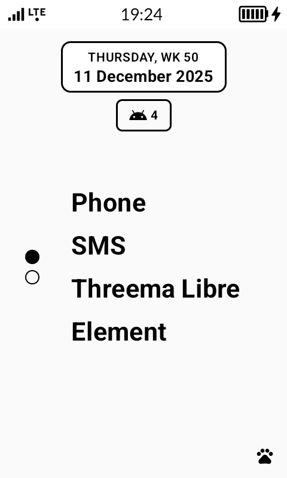
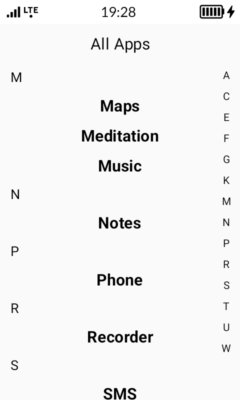
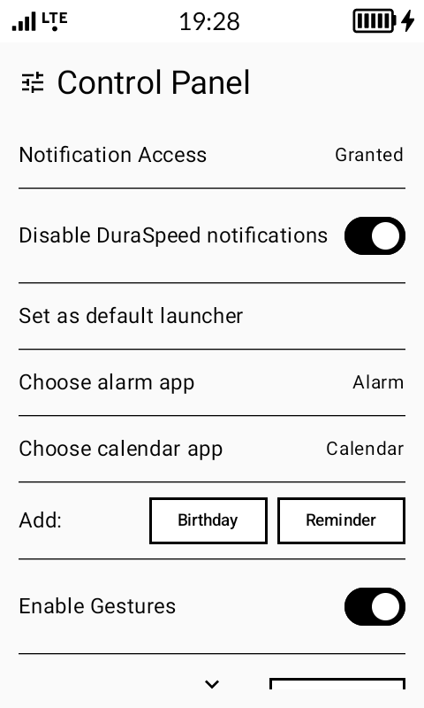
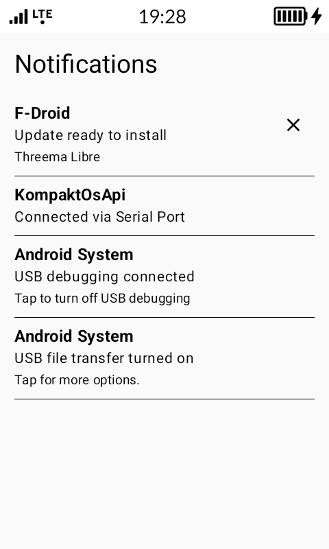
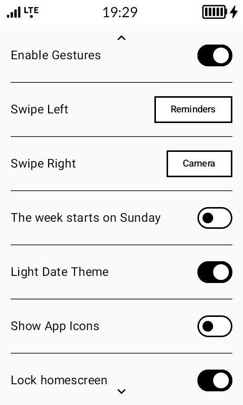
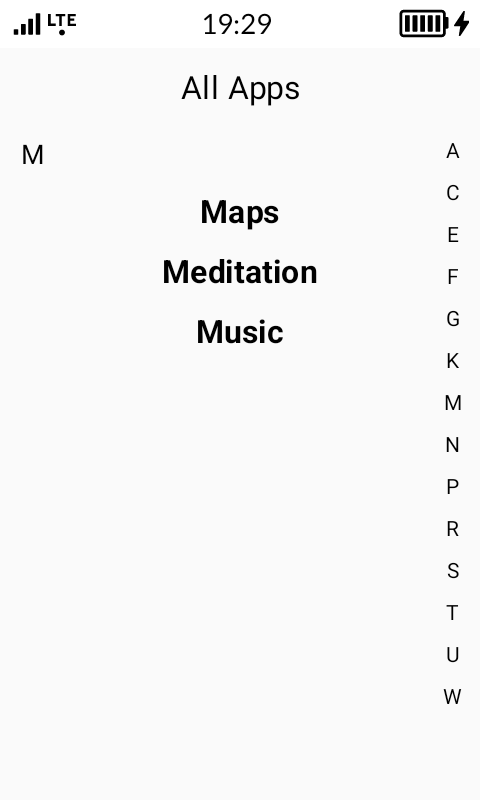
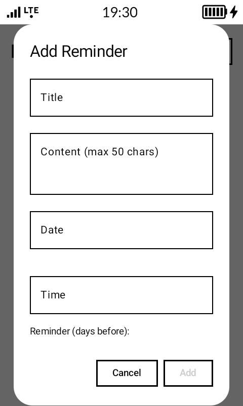
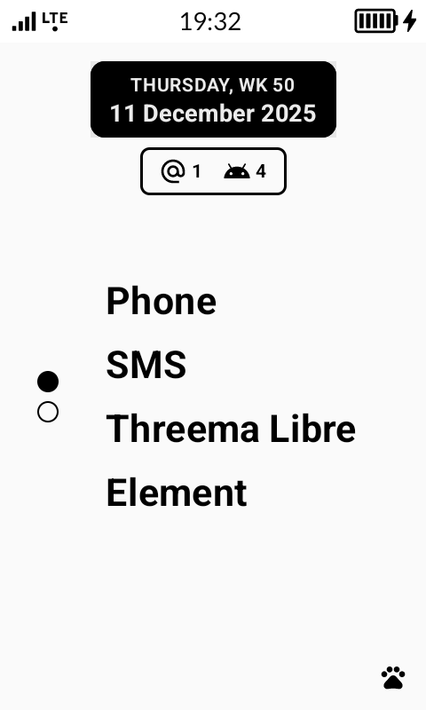
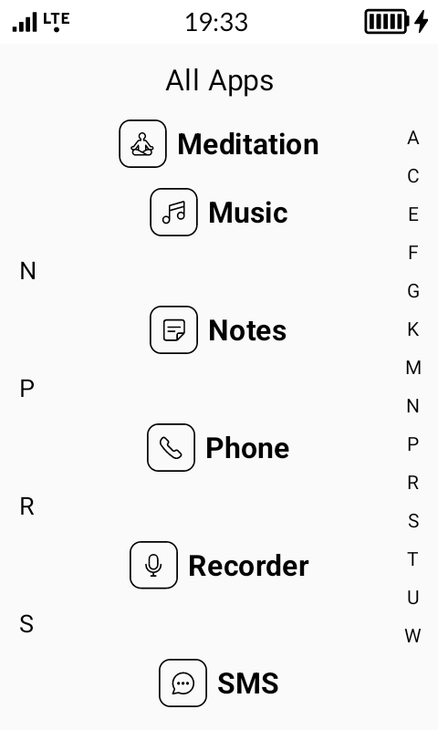

# Sexy Launcher

A minimalist, e-ink friendly launcher for Android, designed specifically for the **Mudita Kompakt** phone to provide a clean, fast, and focused user experience.

## Features

- **Minimalist Home Screen**: Displays your favorite apps, the current date, next alarm, customizable battery level indicator, and birthday reminders.
- **Customizable Battery Indicator**: Set a threshold (0-100%) in the Control Panel to determine when the battery level is displayed.
- **Customizable Favorites**: Choose the number of favorite app slots on your home screen.
- **Integrated Notifications**: A dedicated screen for all your notifications, with intelligent filtering to remove redundant app summaries and message history for conversations.
- **MiniPlayer**: A compact media controller that appears automatically when music is playing, with play/pause and skip controls.
- **Mudita Integration**: Optimized for Mudita Kompakt with automatic default app detection (Alarm, Calendar).
- **Layout Stability**: Fixed-height rows and optimized spacing to prevent UI "jumping" on the home screen.
- **App Drawer**: A simple A-Z list of all your applications with a fast-scroll alphabet index.
- **App Customization**: Long-press an app in the drawer to rename or uninstall it.
- **Gesture Control**:
    - Swipe up to open the app drawer.
    - Customizable left and right swipe actions (e.g., open birthdays, or a specific app).
- **E-Ink Friendly Theming**:
    - Toggle app icons on/off for a purely text-based experience ("Show App Icons").
    - Choose between a light and dark theme for the date widget ("Inverted Date Theme").
- **Font & Typography Customization**:
    - Choose from different font families: Sans Serif, Serif, and Monospace.
    - Independent font size controls for Home Screen, All Apps, and Notifications.
    - "Small", "Normal", and "Big" scaling options to fit your preference.

## Screenshots

<table>
  <tr>
    <td align="center"> <b>Homescreen</b></td>
    <td align="center"> <b>All Apps</b></td>
    <td align="center"> <b>Control Panel</b></td>
    <td align="center"> <b>Notifications</b></td>
  </tr>
  <tr>
    <td align="center"> <b>Customize App</b></td>
    <td align="center"> <b>Filter by Letter</b></td>
    <td align="center"> <b>Add Reminders</b></td>
    <td align="center"> <b>Inverted Date Theme</b></td>
  </tr>
  <tr>
    <td align="center" colspan="4"> <b>Show/Hide App Icons</b></td>
  </tr>
</table>
