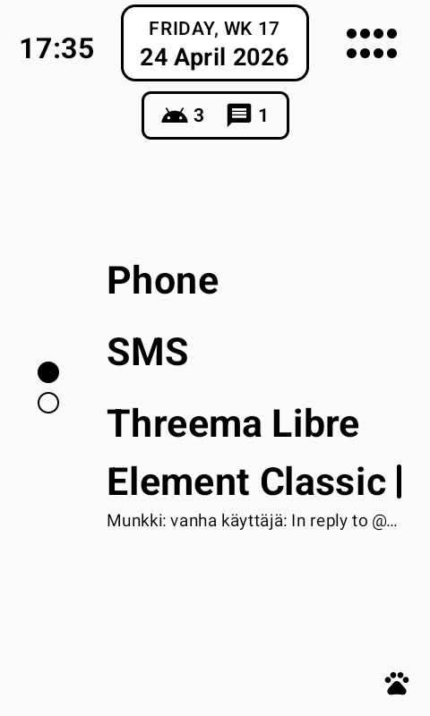
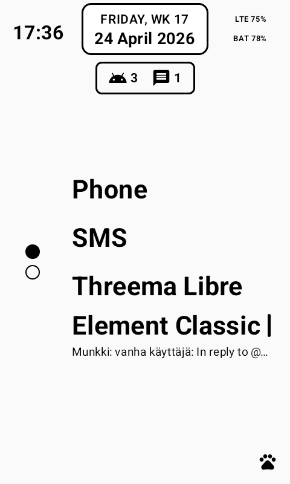
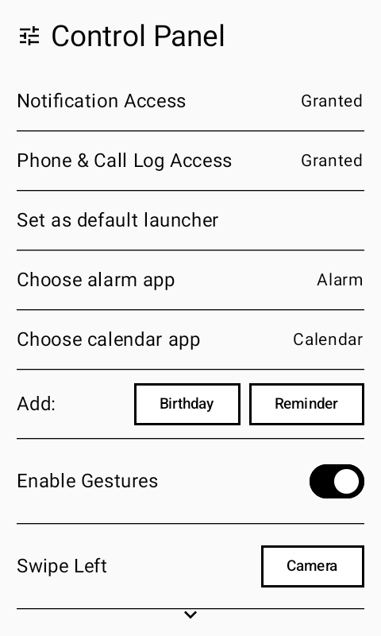
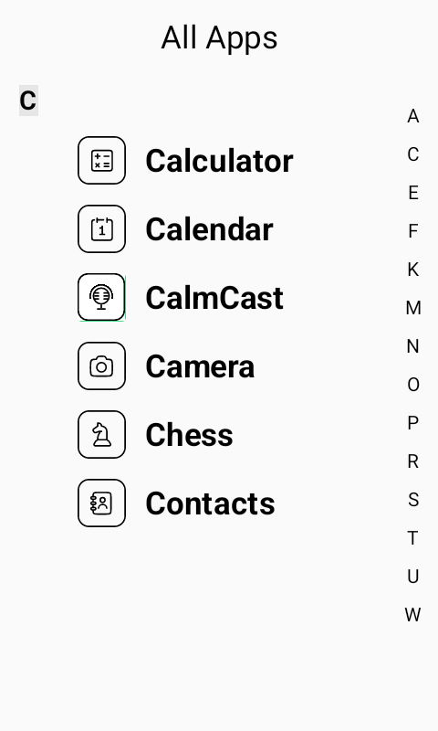

# Sexy Launcher 4.5

A minimalist, e-ink friendly launcher designed specifically for the **Mudita Kompakt**.

## New in Version 4.5
- **Notification Badges**: Favorite apps on the home screen now feature a black notification badge with a count (1-9 or "!" for more).
- **Improved Home UI**: Optimized layout for favorite apps with automatic name shortening to ensure notification badges are always visible.
- **Enhanced Privacy Previews**: Customizable notification character limits (20, 40, 60, 80, 100) with a new default of 60.
- **Smart SMS & Call Counting**: Improved logic to sync unread counts directly from system databases for the default Phone and Messaging apps.
- **Bug Fixes**: Resolved issues where system notifications (like "Connected via serial port") would incorrectly appear under favorite apps.
- **Birthday Integration**: Support for importing birthdays from the **Birday** app (compatibility with Birday app backups).

## Privacy & Permissions
Sexy Launcher is built with a "Privacy First" approach. **No personal data ever leaves your device.** All processing of notifications, messages, and contacts happens locally.

To provide its core features, the app requires the following permissions:
- **Notification Access**: Needed to display your alerts and messages in the dedicated "Notifications" screen. This is the only way for the launcher to show you what's happening in other apps.
- **Read SMS**: Used solely to count and display the number of unread text messages on the home screen. The app does not "read" your messages for any other purpose.
- **Read Call Log**: Required to show missed calls and to identify callers in the notification view so you know who tried to reach you.
- **Read Phone State**: Allows the launcher to detect active calls and show a "Call in progress" indicator, making it easy to return to your call.
- **Read Contacts**: Used to resolve phone numbers into contact names (e.g., showing "Mom" instead of a number) locally on your device.
- **Exact Alarm**: Necessary for the Reminders and Birthdays features to trigger notifications precisely at the scheduled time.
- **Bluetooth**: Used to show the name of your connected headset or device in the status header.

## Key Features
- **Mudita Integration**: Full support for system apps from Mudita Kompakt.
- **E-Ink Optimized**: High-contrast, text-first design with hollow-dot status icons.
- **Interactive Header**: Fast access to clock, battery status (with charging indicator), and system info.
- **Focus-Oriented Navigation**: Minimalist app drawer with alphabetical scroller and customizable favorite apps.

## Designed for Focus
Sexy Launcher provides a clean, fast, and intentional user experience, replacing clutter with essential information. It transforms your Mudita Kompakt into an even more powerful tool for digital well-being.

## Screenshots

<table>
  <tr>
    <td align="center"> </td>
    <td align="center"> </td>
    <td align="center"> </td>
    <td align="center"> </td>
  </tr>
</table>
