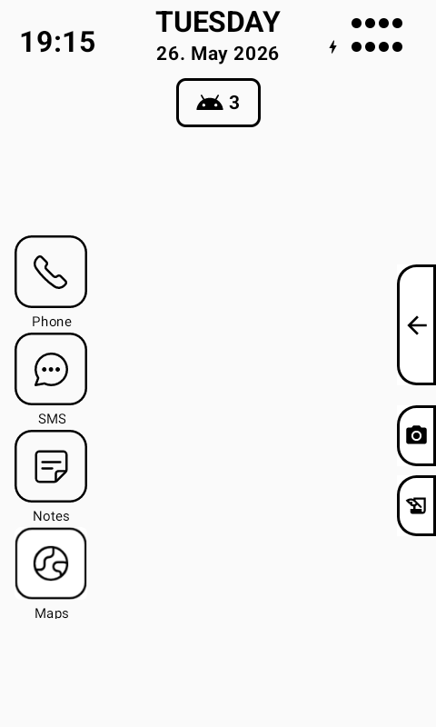
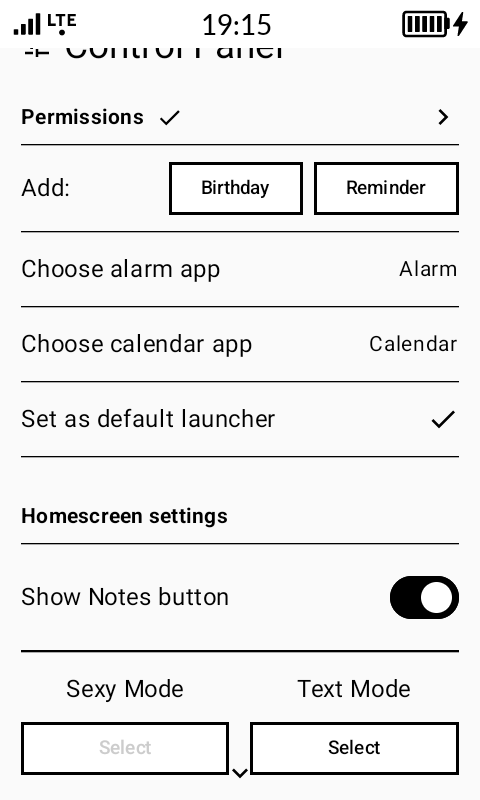
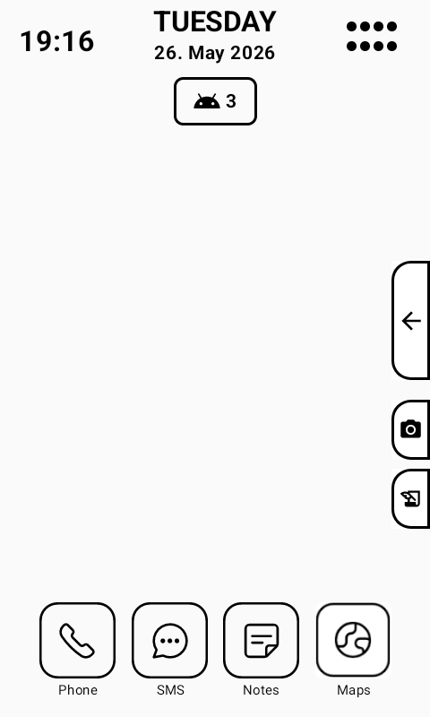
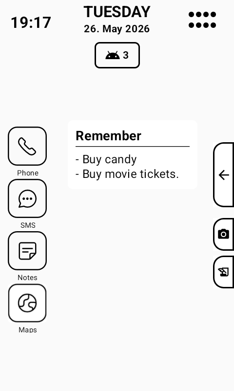
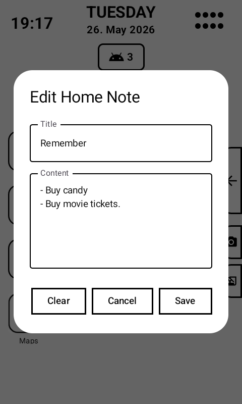
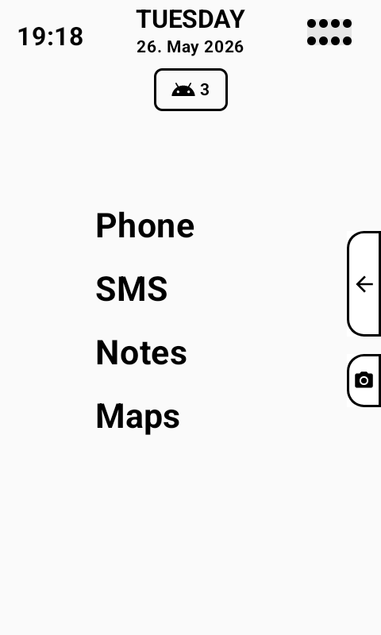

# Sexy Launcher

A minimalist, e-ink friendly launcher designed specifically for the Mudita Kompakt and other Android-based e-ink devices. Focus on your essentials with a high-contrast, distraction-free interface.

## Key Features in Version 5.0

*   **New Sexy Mode (Default)**: A modern grid-based layout with square icons.
    *   **Left Alignment**: Vertical strip of favorites on the left, leaving space for notes and shortcuts.
    *   **Bottom Alignment**: Horizontal row of favorites at the bottom for easy thumb access.
*   **Minimalist Text Mode**: For those who prefer absolute simplicity, a clean text-only interface.
*   **Integrated Home Note**: Create and edit quick reminders or lists directly on your home screen using the quill icon (+).
*   **E-Ink Optimized**: High-contrast pure black and white design with specialized hollow-dot status icons for battery and signal.
*   **Mudita Integration**: Seamless support for Mudita system apps (Phone, Messages, Alarm, etc.).
*   **Privacy First**: No data ever leaves your device. All processing of notifications and personal information is done locally.

## Screenshots

  
  
  

  
  
  

## Installation

1.  Download the latest `app-release.apk` from the [Releases](https://github.com/Boris55555/Sexy-Launcher/releases) section.
2.  Install it on your Mudita Kompakt or other e-ink device.
3.  Set Sexy Launcher as your default home application in the device settings.

## Usage

*   **Settings (Control Panel)**: Long press an empty space on the home screen or double-tap the cat icon if the screen is locked.
*   **All Apps**: Press the dedicated button on the right edge of the home screen.
*   **Add/Edit Note**: Press the quill icon (+) on the right side in Sexy Mode.
*   **App Actions**: Long press any app in the app list to rename or uninstall.

## License

This project is licensed under the GPL-3.0 License.
